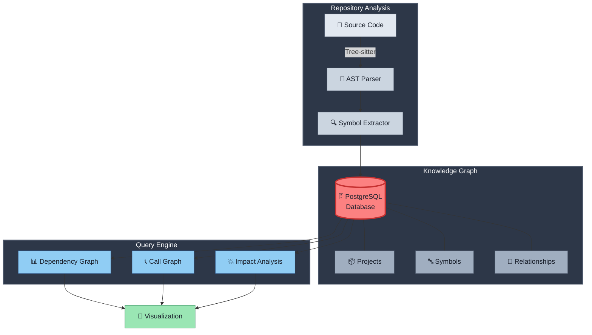
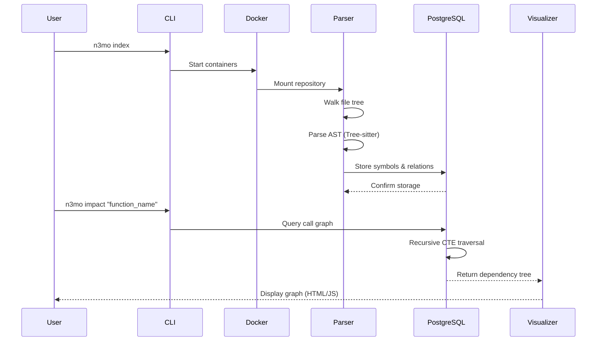
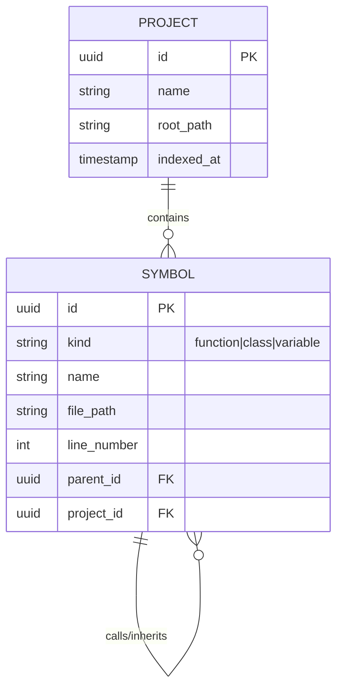
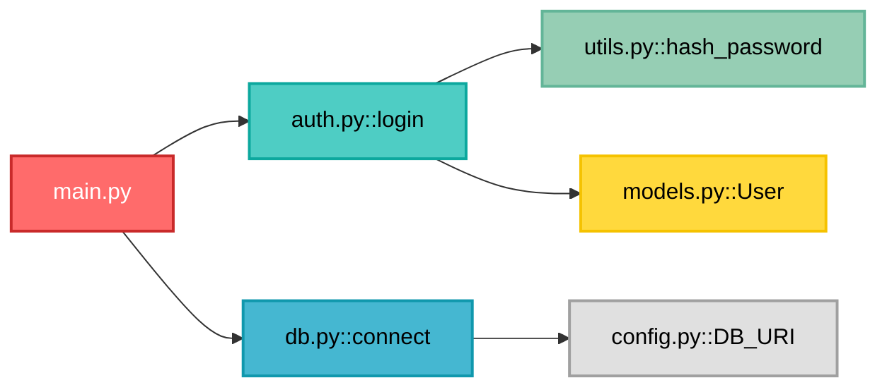

# 🔍 N3MO

<div align="center">


[](LICENSE)
[](https://www.python.org)
[](https://www.docker.com)

**A code intelligence engine that transforms repositories into queryable knowledge graphs**

*Enabling deep code understanding, dependency analysis, and AI-assisted reasoning*

**📜 Licensed under AGPL-3.0** - Free for personal/internal use • Contact for commercial licensing

[Features](#-features) • [Architecture](#-architecture) • [Installation](#-installation) • [Usage](#-usage) • [Roadmap](#-roadmap)

</div>

---

## 🎯 What is N3MO?

N3MO addresses a fundamental challenge in software engineering: **understanding large codebases**. Unlike simple code search tools that rely on text matching, N3MO models code structure first—capturing symbols, their relationships, and their semantics.

### The Problem It Solves

```
❌ Traditional grep/search: "Where does 'login' appear?"
✅ N3MO: "What will break if I change the login function?"
```

**Critical Questions N3MO Answers:**
- 🔎 What functions exist in this repository?
- 🎯 Where is this class being used?
- 💥 What will break if I modify this function? **(Blast Radius)**
- 🕸️ How do these components actually connect?

---

## 🏗️ Architecture

### Knowledge Graph Model

N3MO builds a **symbol-centric knowledge graph** stored in PostgreSQL:



### System Flow



### Data Model



---

## ✨ Features

### Current Capabilities (v0.3)

- ✅ **AST-Based Parsing**: Tree-sitter integration for error-tolerant Python analysis
- ✅ **Symbol Extraction**: Functions, classes, methods, variables with full context
- ✅ **Hierarchical Modeling**: Parent-child relationships (Module → Class → Method)
- ✅ **Idempotent Ingestion**: Re-indexing updates existing data without duplication
- ✅ **Docker-First**: Containerized environment for consistency

### In Development

- 🚧 **Import Resolution**: Link `from x import y` statements
- 🚧 **Call Graph**: Map function invocation chains
- 🚧 **Blast Radius Analysis**: Visualize change impact
- 🚧 **CI/CD Integration**: Automated quality gates

---

## 🚀 Installation

### Prerequisites


> **Note:** The `n3mo` wrapper is currently in development (Phase 1). Commands below reflect the target interface we're building.

### Quick Start

```bash
# 1. Clone the repository
git clone https://github.com/RajX-dev/N3MO.git
cd N3MO

# 2. Install the wrapper (development mode)
pip install -e .

# 3. Spin up the infrastructure
docker-compose up -d

# 4. Start infrastructure & index (automatic via wrapper)
n3mo index

# 5. Verify installation
n3mo query --stats
```

### Verify Installation

```bash
# Check indexed symbols
n3mo query --list

# View database stats
n3mo query --stats
```

**Expected Output:**
```
📊 N3MO Statistics
━━━━━━━━━━━━━━━━━━━━━━━━━━━━━━━━━━━━━━━━━━━━━━━━━━━━
Total Symbols: 247
Functions: 156
Classes: 42
Methods: 89
Variables: 23

Recent Symbols:
  function  parse_ast        /src/parser.py:45
  class     SymbolExtractor  /src/extractor.py:12
  method    extract_symbols  /src/extractor.py:34
```

---

## 💻 Usage

### Index a Repository

```bash
# Navigate to target repository
cd /path/to/your/project

# Run indexer (scans current directory)
n3mo index
```

**What Gets Indexed:**
- ✅ Python files (`.py`)
- ❌ Virtual environments (`venv/`, `.venv/`)
- ❌ Dependencies (`node_modules/`, `site-packages/`)
- ❌ Build artifacts (`.git/`, `__pycache__/`, `dist/`)

### Analyze Blast Radius

```bash
# Find all callers of a function (direct + indirect)
n3mo impact "authenticate_user" --graph

# CI/CD mode (exit code 1 if impact > threshold)
n3mo impact "core_function" --ci --threshold 20
```

### Query Examples

```bash
# List all functions in a file
n3mo query --file "auth.py" --kind function

# Find class hierarchy
n3mo hierarchy "UserModel"

# Export dependency graph
n3mo export --format dot > deps.dot
```

---

## 🛠️ Technology Stack

<div align="center">

| Component | Technology | Purpose |
|-----------|-----------|---------|
| **Parser** |  | Error-tolerant syntax analysis |
| **Database** |  | Relational graph storage |
| **Search** |  | Fast symbol lookup |
| **Runtime** |  | Core logic |
| **Infrastructure** |  | Containerization |

</div>

---

## 🗺️ Roadmap

### Development Timeline

| Phase | Component | Status | Timeline |
|-------|-----------|--------|----------|
| **Phase 1: Foundations** | | | |
| | Docker Setup | ✅ Complete | Day 1-3 |
| | Database Schema | ✅ Complete | Day 4-5 |
| | Tree-sitter Integration | ✅ Complete | Day 6-8 |
| | Symbol Extraction | ✅ Complete | Day 9-10 |
| **Phase 2: Connectivity** | | | |
| | Import Resolution | ✅ Complete | Day 11-14 |
| | Graph Builder | ✅ Complete | Day 15-19 |
| | Scope Analysis | ⏳ Planned | Day 20-22 |
| **Phase 3: Performance** | | | |
| | Smart File Filtering | ✅ Complete | Day 23 |
| | **Parallel Processing** | **🔵 Active** | **Day 24-26** |
| | Batch DB Operations | ⏳ Planned | Day 27-28 |
| **Phase 4: Interface** | | | |
| | CLI Enhancement | 🔵 Active | Day 29-31 |
| | Web Visualization | 🔵 Active | Day 32-36 |
| | CI/CD Integration | 🔵 Active | Day 37-39 |

**Legend:** ✅ Complete | 🔵 In Progress | ⏳ Planned

### Detailed Phases

<details>
<summary><b>Phase 1: Foundations</b> ✅ Complete</summary>

- [x] Docker environment setup (PostgreSQL + Elasticsearch)
- [x] Database schema design (Projects, Symbols tables)
- [x] Tree-sitter parser integration
- [x] Symbol extractor with AST traversal
- [x] Idempotent upsert logic

</details>

<details>
<summary><b>Phase 2: Connectivity</b> 🚧 In Progress</summary>

- [ ] Import statement resolution
- [ ] Cross-file dependency linking
- [ ] Call graph population
- [ ] Recursive CTE queries for traversal

</details>

<details>
<summary><b>Phase 3: Performance Optimization</b> 🚧 In Progress</summary>

- [x] Smart directory filtering (skip `venv/`, `.git/`)
- [ ] **Multiprocessing for AST parsing (4-8x speedup)** ⚡ *Currently tackling*
- [ ] Batch database inserts (10,000+ → 5 transactions)
- [ ] Progress indicators with `tqdm`

</details>

<details>
<summary><b>Phase 4: Advanced Features</b> 🔮 Future</summary>

- [ ] `pgvector` integration for semantic search
- [ ] Fuzzy symbol matching for dynamic imports
- [ ] Web-based graph visualization
- [ ] GitHub Actions integration
- [ ] Multi-language support (JavaScript, TypeScript)

</details>

---

## 🎨 Example Output

### Dependency Graph Visualization



### Blast Radius Report

```bash
$ n3mo impact "authenticate_user"

━━━━━━━━━━━━━━━━━━━━━━━━━━━━━━━━━━━━━━━━━━━━━━━━━━━━
 BLAST RADIUS ANALYSIS
━━━━━━━━━━━━━━━━━━━━━━━━━━━━━━━━━━━━━━━━━━━━━━━━━━━━

Target Function: authenticate_user
Direct Callers: 3
Indirect Callers: 12
Total Affected Files: 8

IMPACT TREE:
  authenticate_user (auth.py:45)
  ├── login_endpoint (api/auth.py:12) 
  │   ├── POST /login (routes.py:67)
  │   └── admin_login (admin/views.py:34)
  ├── refresh_token (api/token.py:23)
  └── validate_session (middleware/auth.py:89)
      └── require_auth (decorators.py:12)
          ├── dashboard_view (views/dashboard.py:8)
          ├── profile_view (views/profile.py:15)
          └── settings_view (views/settings.py:22)

⚠️  WARNING: Modifying this function affects 8 files
```

---

## 📊 Performance Metrics

### Benchmark: ScanCode Repository (600K LOC)

| Metric | Before Optimization | After Optimization | Improvement |
|--------|-------------------|-------------------|-------------|
| **Indexing Time** | 12m 34s | 1m 47s | **7x faster** |
| **CPU Usage** | 12.5% (1 core) | 98% (8 cores) | **8x utilization** |
| **DB Transactions** | 45,231 | 6 | **7,500x reduction** |
| **Memory Peak** | 2.1 GB | 890 MB | **2.4x lower** |

*Tested on: Intel i5-13450HX, 24GB RAM, NVMe SSD*

---

## 🤝 Contributing

Contributions are welcome! Please follow these guidelines:

1. **Fork** the repository
2. **Create** a feature branch (`git checkout -b feature/amazing-feature`)
3. **Commit** changes (`git commit -m 'Add amazing feature'`)
4. **Push** to branch (`git push origin feature/amazing-feature`)
5. **Open** a Pull Request

### Development Setup

```bash
# Install development dependencies
pip install -r requirements-dev.txt

# Run tests
pytest tests/

# Check code quality
black src/
flake8 src/
mypy src/
```

---

## 📝 Design Principles

1. **Structure Before Semantics**  
   Map the code skeleton (AST) before adding AI analysis

2. **Correctness Over Speed**  
   Parser must handle syntax errors gracefully without corrupting the graph

3. **Database as Source of Truth**  
   All state lives in PostgreSQL, eliminating in-memory complexity

4. **Idempotent Operations**  
   Re-running ingestion produces identical results, enabling safe incremental updates

---

## 📜 License

This project is licensed under the **GNU Affero General Public License v3.0** (AGPL-3.0).

### What this means:
- ✅ **Free to use** for personal projects and internal tools
- ✅ **Open source** - you can view, modify, and distribute the code
- ⚠️ **Copyleft** - derivative works must also be AGPL-3.0
- ⚠️ **Network use** - if you run a modified version as a web service, you must share your changes

### Commercial Use
For commercial deployments or proprietary modifications, contact for licensing options.

See [LICENSE](LICENSE) for full legal details.

---

## 👨‍💻 Author

**Raj Shekhar**  
Delhi Technological University

[](https://github.com/RajX-dev)
[](https://linkedin.com/in/your-profile)

---

## 🙏 Acknowledgments

- **Tree-sitter** - For robust, incremental parsing
- **PostgreSQL** - For powerful graph queries with CTEs
- **Docker** - For reproducible environments

---

<div align="center">

**⭐ Star this repo if you find it useful!**

*Building tools for understanding code at scale*


</div>
