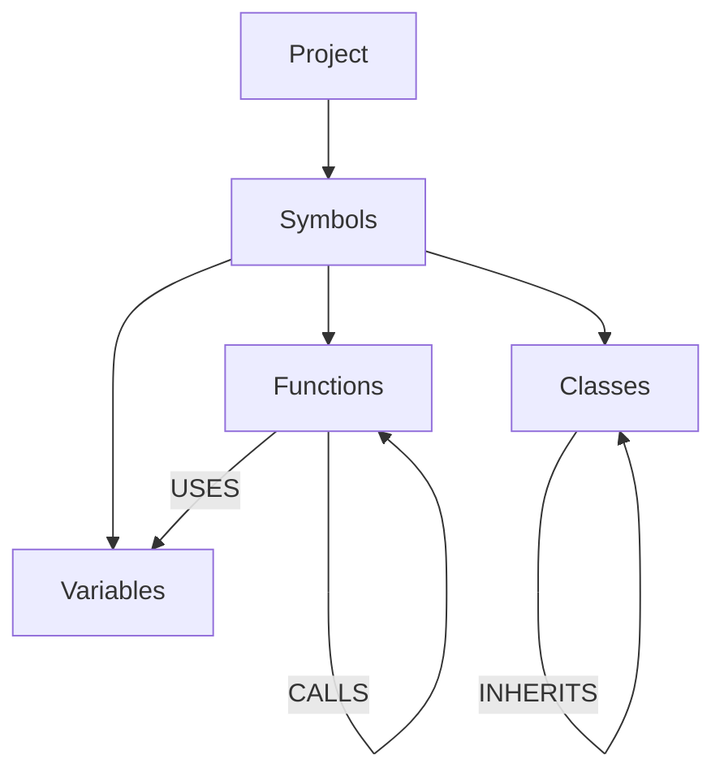

# CodeSeer

**A code intelligence engine that transforms repositories into queryable knowledge graphs of code symbols, enabling deep code understanding, dependency analysis, and AI-assisted reasoning.**

---

## Overview

CodeSeer addresses a fundamental challenge in software engineering: **understanding large codebases**. Unlike simple code search tools that rely on text matching, CodeSeer models code structure first—capturing symbols, their relationships, and their semantics—enabling precise queries about dependencies, impact analysis, and architectural patterns.

### The Solution

CodeSeer answers critical questions that traditional tools cannot:

- What functions exist in this repository?
- Where is this class being used?
- What will break if I modify this function?
- How do these components actually connect?

---

## Architecture

### Knowledge Graph Model

CodeSeer builds a **symbol-centric knowledge graph** stored in PostgreSQL:



### Key Design Decisions

- **SQL-first schema**: Leverages PostgreSQL's ACID guarantees and recursive CTEs for hierarchy.
- **AST-Based Parsing**: Uses **Tree-sitter** for accurate, error-tolerant symbol extraction (not Regex).
- **Idempotent Ingestion**: Re-indexing updates existing records via `ON CONFLICT` logic; never creates duplicates.
- **Dockerized Architecture**: Fully containerized environment ensuring "write once, run anywhere" reliability.

---

## Current Capabilities

### Phase 1: Complete

**Repository Ingestion**
- Recursive directory scanning (`ingest_files.py`)
- Source file identification and normalization
- **Tree-sitter Integration**: parsing Python code into Abstract Syntax Trees (AST)

**Knowledge Graph Storage**
- **Hierarchical Schema**: Symbols stored with `parent_id` pointers (Module → Class → Method)
- **Identity Management**: Stable UUID generation for every code symbol
- **Data Integrity**: Foreign key constraints enforce project and parent linkages

---

## Roadmap

### Phase 1: Foundations (Complete)

- [x] Docker environment setup (Indexer + Postgres)
- [x] Database Schema Design (Symbols, Projects)
- [x] Tree-sitter Parser Integration
- [x] Symbol Extractor & Mapper
- [x] Idempotent "Upsert" Writer

### Phase 2: Connectivity (In Progress)

- [ ] Import Resolution (Linking `from x import y`)
- [ ] Scope Analysis (Local vs Global variables)
- [ ] Call Graph Population
- [ ] Recursive Dependency Queries

### Phase 3: Semantic Intelligence

- [ ] `pgvector` Integration
- [ ] Code Embedding Generation
- [ ] Semantic Search API

### Phase 4: Interface

- [ ] CLI Polish
- [ ] Terminal UI (TUI)
- [ ] Web Visualization

---

## Tech Stack

| Component | Technology |
| --- | --- |
| **Core Logic** | Python 3.10+ |
| **Parsing Engine** | Tree-sitter (Python Bindings) |
| **Database** | PostgreSQL 15 (Relational Data) |
| **Search Engine** | Elasticsearch 8 (Text Search) |
| **Infrastructure** | Docker & Docker Compose |

---

## Getting Started

### Prerequisites

- Docker Desktop (Running)
- Git

### Installation & Usage

CodeSeer runs entirely within Docker to ensure a consistent environment.

**1. Clone the repository**
```bash
git clone https://github.com/RajX-dev/CODESEER-MAIN.git
cd CODESEER-MAIN
```

**2. Start the Infrastructure**

This spins up PostgreSQL and Elasticsearch in the background.
```bash
docker-compose up -d
```

**3. Build the Indexer**

Compiles the Python environment and Tree-sitter grammars.
```bash
docker-compose build indexer
```

**4. Run Ingestion (Self-Index)**

Tells CodeSeer to scan itself as a test.
```bash
docker-compose run --rm indexer python ingest_files.py
```

**5. Verify Data**

Check the database to see the extracted symbols.
```bash
docker exec -it codeseer-postgres psql -U codeseer -d codeseer -c "SELECT kind, name, file_path FROM symbols LIMIT 10;"
```

---

## Design Principles

1. **Structure before semantics:** We map the code skeleton (AST) before adding AI brains.
2. **Correctness over speed:** The parser must handle syntax errors gracefully.
3. **Database as the Source of Truth:** All state lives in Postgres, not in Python memory.

---

## Author

**Raj** | [GitHub](https://github.com/RajX-dev)

*Building tools for understanding code at scale.*
