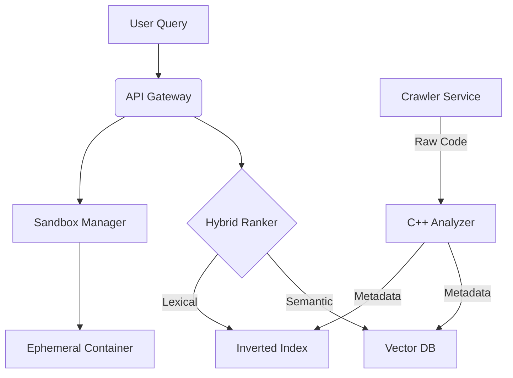

# CodeSeer 👁️

> **A Distributed Semantic Code Search Engine with Sandboxed Execution.**

CodeSeer goes beyond traditional text-based code search. It combines **Vector Embeddings (Semantic)** with **TF-IDF (Lexical)** to understand user intent, and features a **Sandboxed Execution Environment** that allows developers to run discovered snippets securely in isolation.

---

## Key Features

### 1. Hybrid Search Architecture
Most search engines operate on keywords (Lexical) or meaning (Semantic). CodeSeer uses a hybrid ranking algorithm:
* **Semantic Layer:** Uses Transformer-based embeddings to understand "How do I reverse a binary tree?" even without matching keywords.
* **Lexical Layer:** Uses TF-IDF for precise variable/function name matching.
* **Result:** High-precision recall that understands both syntax and intent.
    
### 2. Live Sandboxed Execution 
* **Instant Verification:** Users can execute search results directly in the browser.
* **Isolation:** Code runs in ephemeral Docker containers (sandbox architecture) to prevent host system access.
* **Stateful Output:** Captures stdout/stderr and returns execution time/memory usage.

### 3. High-Performance C++ Indexer
* Core analysis modules are written in **C++** (`analysis-cpp`) to handle heavy AST parsing and static analysis at speed, interfacing with Python via bindings.
* Optimized for low-latency indexing of large repositories.

### 4. Code Intelligence & Visualization
* Visualizes codebase relationships and dependency graphs.
* Provides syntax highlighting and complexity metrics for indexed files.

---

## 🛠️ Tech Stack

* **Core Backend:** Python (FastAPI/Flask)
* **Performance Module:** C++ (Standard 17), CMake
* **Search Engine:** Hybrid implementation (Vector DB + Inverted Index)
* **Infrastructure:** Docker, Docker Compose
* **Database:** PostgreSQL / Redis (for queuing)
* **Frontend:** React / Next.js (assumed based on standard stack)

---

## Architecture Overview

Getting Started
Prerequisites
Docker & Docker Compose

Python 3.9+

C++ Compiler (GCC/Clang)

Installation
Clone the repository

---

Bash
* **git clone [https://github.com/RajX-dev/CODESEER-MAIN.git](https://github.com/RajX-dev/CODESEER-MAIN.git)
* **cd CODESEER-MAIN
* **Build the C++ Analysis Module
---
Bash
* **cd analysis-cpp
* **mkdir build && cd build
* **cmake .. && make
* ** Services via Docker
---

Bash
* **docker-compose up --build
* **Access the Dashboard Visit http://localhost:3000 (or configured port).
